# Termux-X

**基于 ZeroTermux 的深度定制与增强版终端模拟器**

## 📖 项目简介

**Termux-X** 是一款基于 **ZeroTermux** 进行二次开发（二开）的增强版终端模拟器应用。它保留了 ZeroTermux 的强大功能，并在此基础上进行了深度定制与优化，旨在为移动端渗透测试人员和极客提供更便捷、更强大的操作环境。

## 🌟 核心亮点

### 🔥 一键免Root运行完整Kali NetHunter
这是Termux-X最具革新性的突破。我们解决了移动端渗透测试的核心痛点——**无需Root手机**，仅需一次点击，即可在您的智能手机上部署并启动功能完整的Kali NetHunter渗透测试环境。这一设计彻底改变了移动安全审计的可用性，让专业级的安全测试能力真正触手可及。

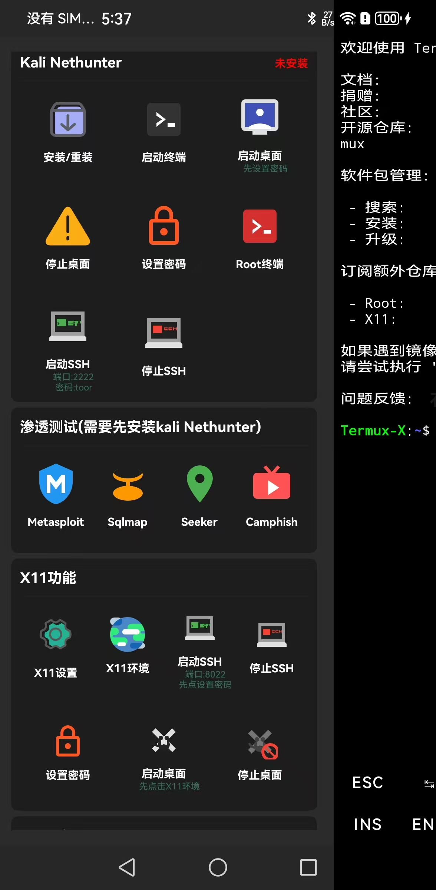

 
 
### 🤖 内置AI智能安全助手
深度整合的AI辅助引擎彻底革新了移动端安全测试的工作流。我们实现了**自然语言到专业Shell命令**的无缝转换——只需用日常语言描述您的需求，系统即可智能生成精准的可执行命令。

**核心功能升级：**

*   **🔍 智能错误诊断系统**
    *   **支持 一键AI报错分析**：终端输出的任何错误信息，均可通过快捷操作实时发送至AI引擎。
    *   **获得 结构化解决方案**：不仅解释错误原因，更提供可执行的修复步骤和预防建议。
    *   **上下文智能关联**：AI自动分析命令历史与输出关系，提供针对性的调试建议。

*   **⚡ 渗透测试智能辅助**
    *   **自动化Payload生成**：根据目标环境参数，智能生成优化的攻击载荷。
    *   **代码审计助手**：实时分析代码片段，识别潜在漏洞和安全风险。
    *   **攻击链智能构建**：协助规划渗透测试流程，推荐最优工具组合。
    

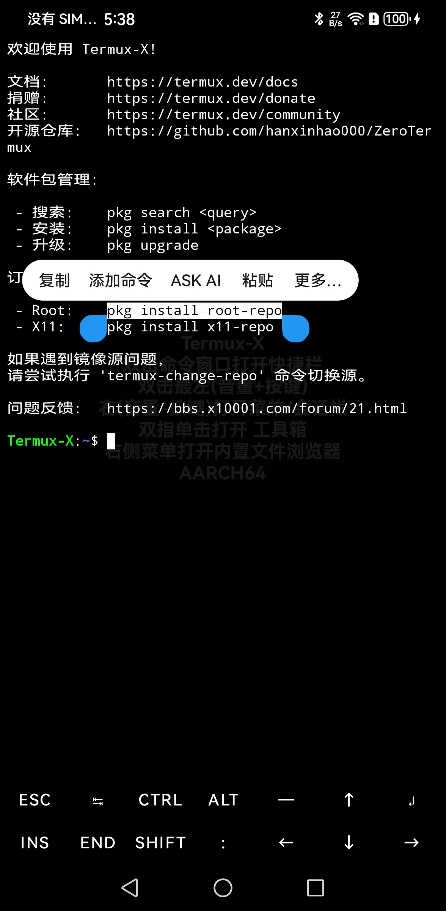

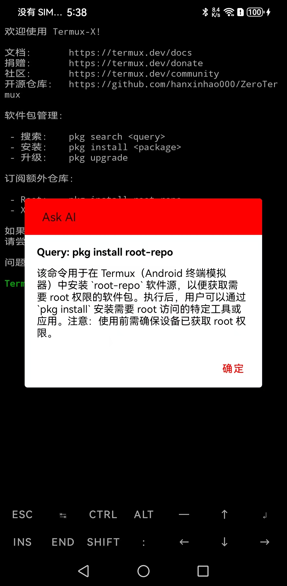

 

### 📦 预置专业工具库
开箱即享专业级工具集，预装并深度集成了 **Metasploit**、**Sqlmap**、**Seeker** 等核心安全测试工具。我们提供了统一的工具入口与管理系统，让复杂的安全工具调用变得简单高效。

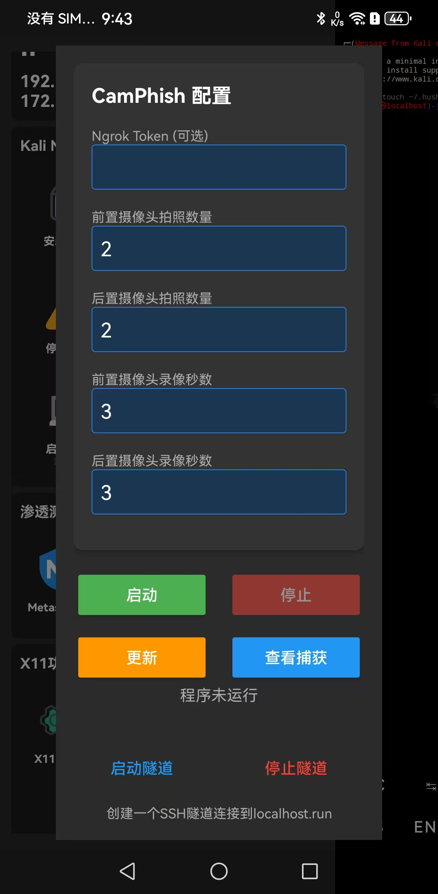
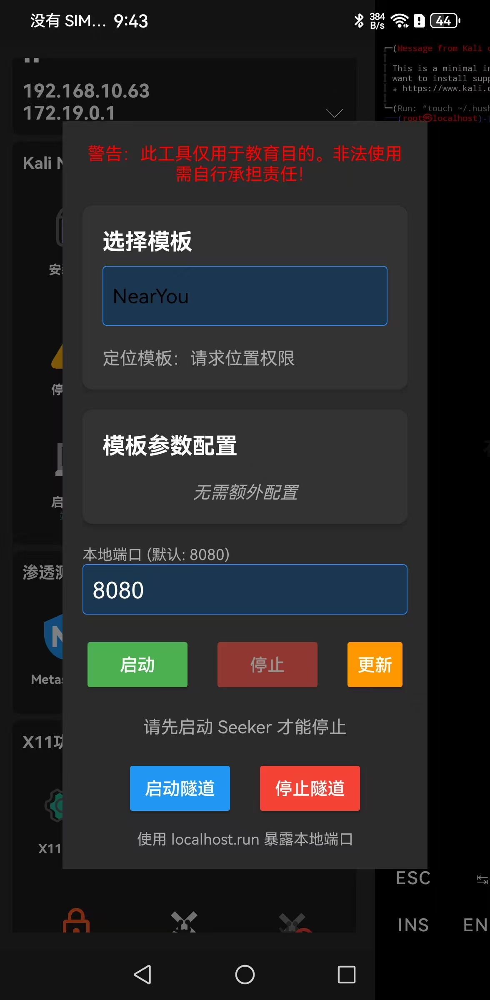
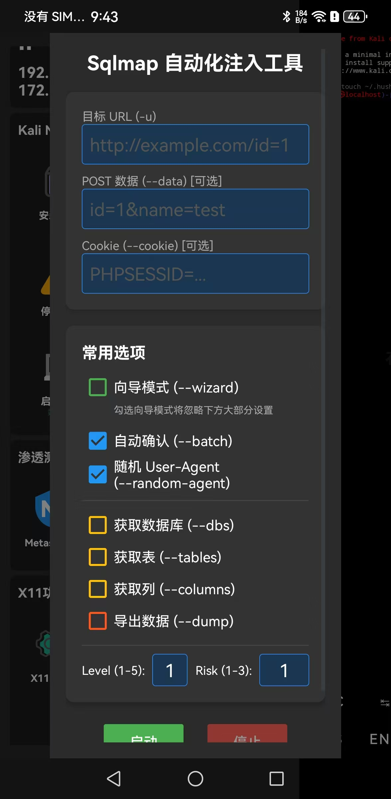
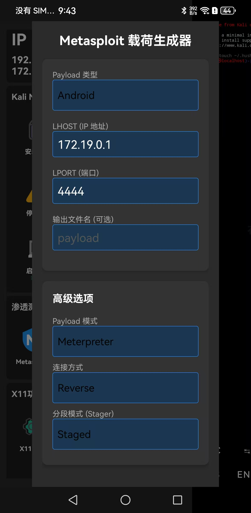

---

## 🖥️ 桌面环境支持

### Termux原生图形化界面
*   **一键启动**：深度整合Termux-X11与XFCE4桌面环境。点击“启动桌面”即可自动完成X11服务配置、环境变量设置及XFCE4桌面启动全过程，告别繁琐的手动命令输入。
*   **智能联动**：自动唤起Termux-X11应用，实现命令行与图形界面的无缝衔接与流畅切换。

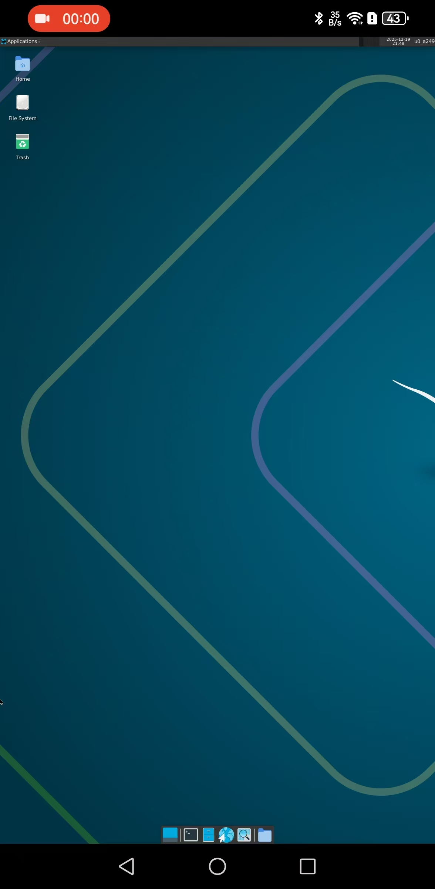
 

### Kali NetHunter图形化桌面
*   **一键KeX连接**：内置完整的NetHunter KeX支持架构。点击“启动图形化”将自动在后台启动KeX服务，并智能跳转至NetHunter KeX客户端，即刻接入完整的Kali Linux桌面环境。
*   **智能依赖检测**：自动检测NetHunter KeX客户端安装状态，如未安装将提供清晰的引导路径，确保体验的完整性。

 

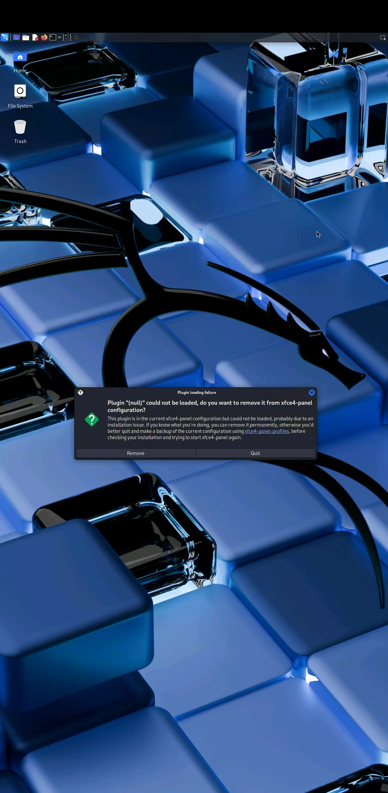
 

---

## 🚀 功能增强

### 智能会话管理系统
*   **交互重构**：彻底重新设计了“会话”按钮的交互逻辑，引入现代化 PopupMenu 菜单设计。
*   **快捷切换**：支持快速选择“新建Termux Shell”或直接进入“Kali Shell”会话，实现不同工作环境的瞬时切换。

---

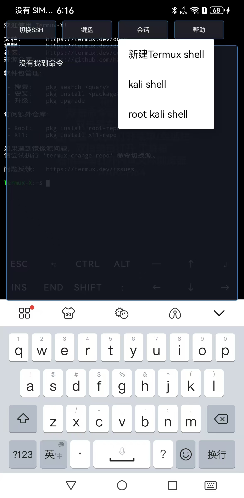
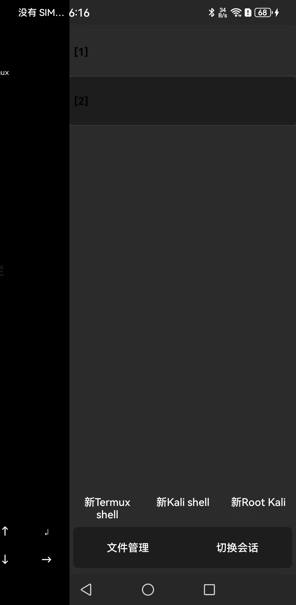

## 📸 应用预览 (Screenshots)

### Termux-X 界面

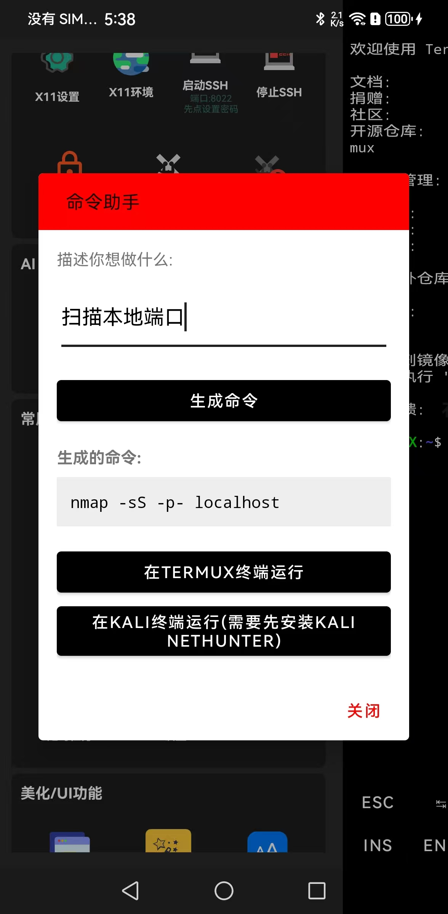

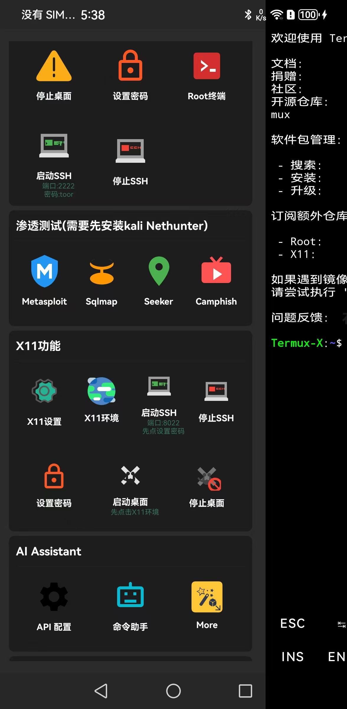

---

## 📝 更新日志 (Changelog)

### v0.118.3.58 (2026.01.24)
*   **新增**：完善 ADB 远程功能，功能详情：
    *   **🔌 连接**：ADB 连接 (USB/WiFi)、Android 11+ 无线配对码连接
    *   **📱 设备**：硬件配置查看、电池状态监控、存储空间分析
    *   **📦 应用**：安装/卸载、**应用提取**、应用冻结/解冻、清除数据
    *   **📂 文件**：内部存储浏览、文件高速上传/下载
    *   **🚀 进程**：实时内存监控、结束进程
    *   **🎮 遥控**：模拟物理按键、虚拟遥控器、**文字输入**
    *   **🛠️ 工具**：截图/录屏、设备重启、**设备镜像投屏（目前还有问题）**、获取顶层窗口、性能监控、日志抓取
    *   **💻 Shell**：内置终端执行自定义命令 (Ping 等)
*   **优化**：优化菜单栏布局，调整功能分类
*   **优化**：诸多性能优化及细节调整
*   **修复**：修复已反馈的 Bug（如 SnowView 空指针异常等）
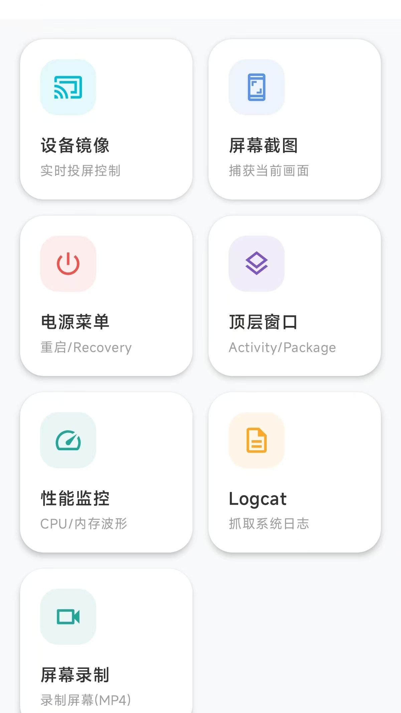
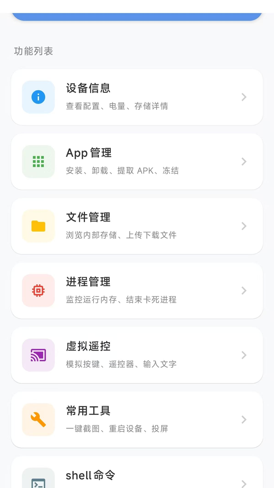
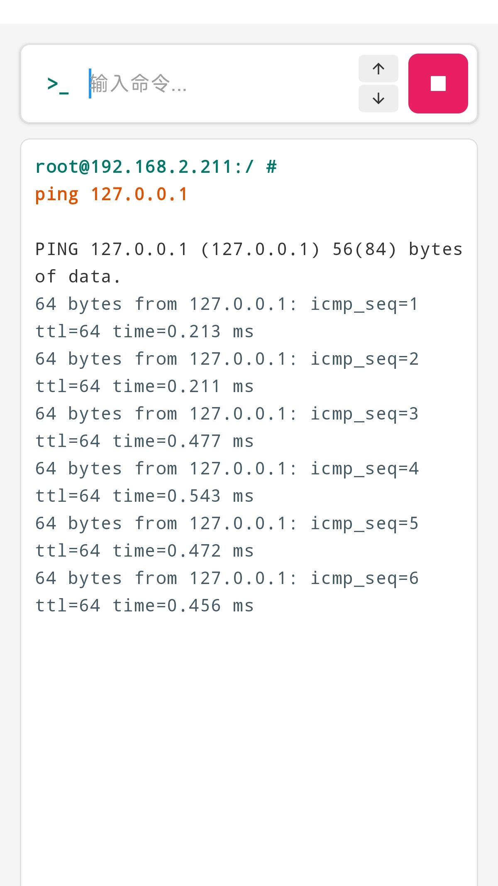
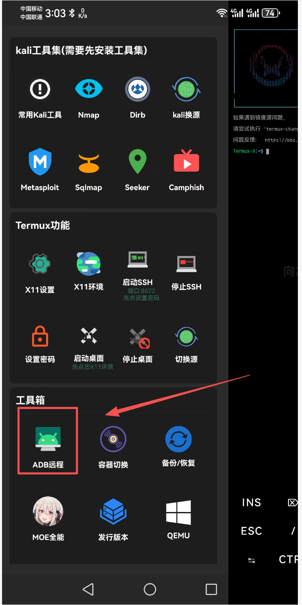
### v0.118.3.57 (2026.01.10)
*   **新增**：在线脚本下载运行逻辑优化，支持自动识别当前环境。若在 Kali Shell 中运行 Termux 脚本，会自动切换至 Termux 会话执行，避免环境错误
*   **新增**：在线脚本支持 Kali Root 环境自动部署。下载的脚本会自动复制到 Kali Root 目录并赋予权限执行，解决路径权限问题
*   **新增**：菜单栏新增“Kali换源”快捷入口，支持一键切换 Kali Linux 软件源（官方、清华、中科大、阿里云），自动进入 Root 环境执行
*   **新增**：在线脚本下载完成后自动识别python脚本文件， 并自动 执行
 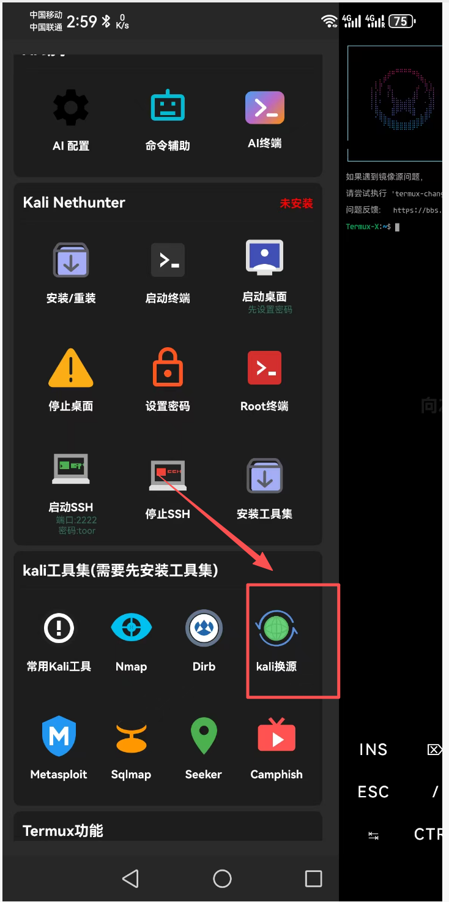
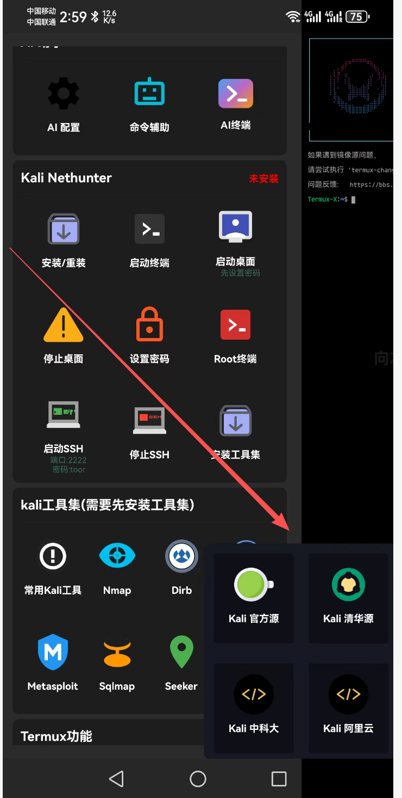

### v0.118.3.56 (2026.01.06)
*   **新增**：集成 **Dirb** 目录扫描工具图形化界面，支持自定义字典、代理、Cookie 及高级扫描选项，自动调用 Kali NetHunter Root 环境执行
*   **优化**：**Nmap** 扫描配置升级，移除 Root 权限强依赖选项，新增免 Root 常用扫描模式（-Pn, -sV, -sC），提升非 Root 环境下的可用性
*   **修复**：优化 Kali 工具调用逻辑，自动检测并安装缺失工具，修复命令执行时的 Shell 兼容性问题
 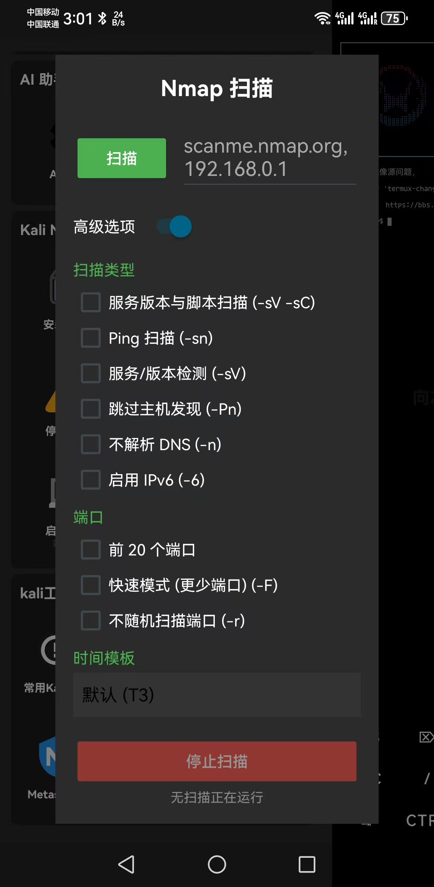
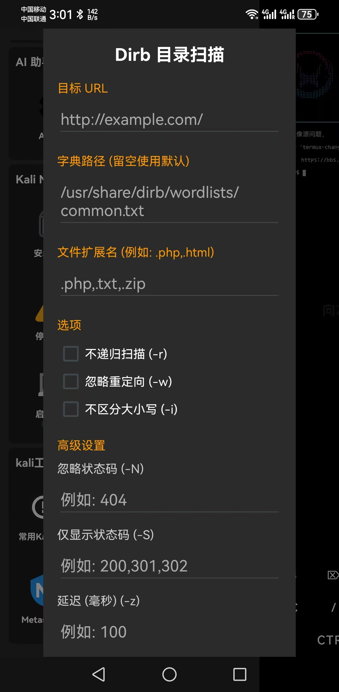
### v0.118.3.56 (2026.01.06)
*   **优化**：QEMU/UTermux 界面中“显示环境”安装逻辑优化，未安装 VNC 插件时自动跳转至下载站
*   **修复**：更新脚本和下载站链接，下载站更新VNC 插件和kali Nethunetr基础包+gemini cli +iflow cli系统包，恢复即用
 
### v0.118.3.56 (2026.01.04)
*   **优化**：Kali NetHunter 安装脚本增强，新增镜像源自动故障切换与重试机制，
*   **交互**：主界面“新增”按钮升级为“AI终端”，集成 Gemini 与 iFlow 垂直菜单
*   **美化**：更新 AI终端、Gemini、iFlow 专属图标
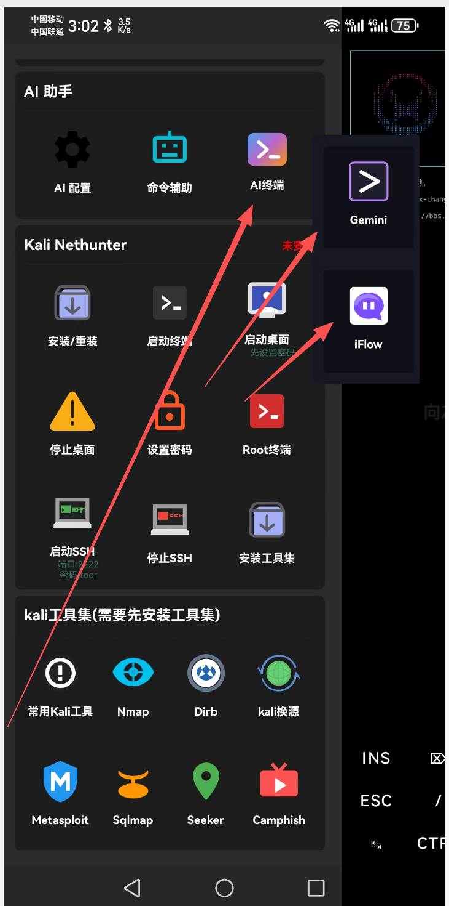
### v0.118.3.56 (2025.12.31)
*   **新增**：Kali 工具集一级分类菜单，支持信息收集、漏洞扫描、Web应用等13大类常用工具的一键调用
*   **新增**：Kali 工具集一键安装/更新按钮，支持自动安装 kali-linux-default 并升级系统
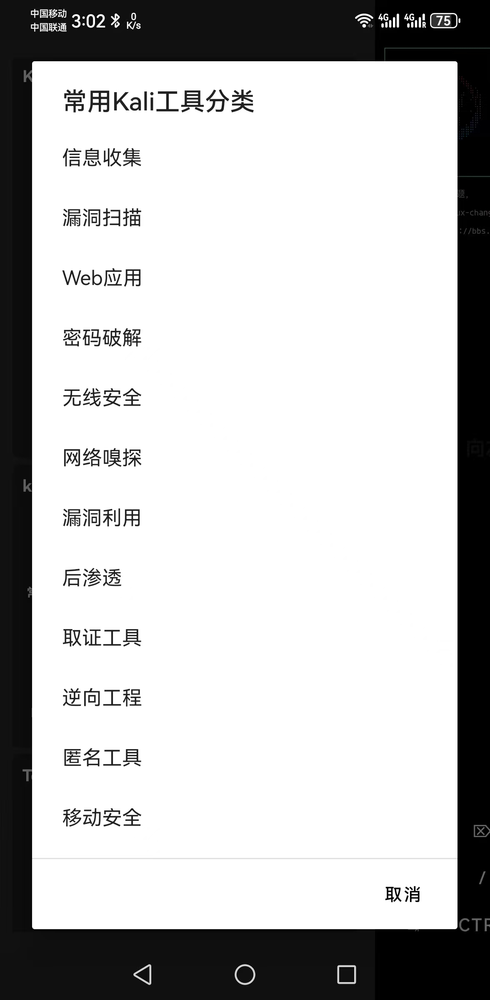

### v0.118.3.55 (2025.12.31)
*   **修复**：Kali NetHunter 菜单操作（启动/停止桌面等）改为新建会话执行，避免在当前 Shell 中冲突
*   **修复**：修复 Kali KeX 启动脚本报错及自动退出问题
*   **新增**：增加ADB功能
*   **优化**：优化布局
*   **修复**：修复未知bug

### v0.118.3.54 (2025.12.29)
*   **新增**：扩展按键栏增加第三排常用按键（INS, DEL, \, |, ~, =, +）
*   **优化**：将新增的常用按键行置顶显示，操作更便捷

### v0.118.3.53 (2025.12.29)
*   **修复**：增加滑出菜单区域，支持第二屏按键扩展
*   **新增**：增加更多键位支持，提供更丰富的操作选项
*   **优化**：调整 TerminalToolbarViewPager 以支持多页按键显示

### v0.118.3.52 (2025.12.27)
 
*   **优化**：Kali NetHunter 安装流程，内置汉化安装脚本，无需网络下载，提高安装成功率
*   **新增**：AI 助手支持多轮对话，具备上下文记忆能力，支持连续追问
*   **重构**：全新聊天式界面布局，集成滚动历史记录与底部输入框
*   **美化**：引入 Markwon 库渲染 Markdown 内容，代码块、列表、粗体等格式完美显示
*   **交互**：增强代码块交互，支持点击代码块弹出“执行/复制”菜单，实现一键运行
*   **修复**：AI 助手命令执行逻辑，支持自动创建文件并运行等多步操作 

### v0.118.3.51 (2025.12.26)
*   **修复**：CamPhish 文件导出功能，现在可以正确导出并查看捕获的文件
*   **优化**：文件导出使用独立会话，不再干扰前台进程
*   **新增**：支持查看 .webm 格式的视频文件
*   **修复**：文件列表点击无响应的问题
*   **修复**：停止按钮状态检测及 Ctrl+C 信号发送逻辑

### v0.118.3.50 (2025.12.20)
*   首次发布 基于ZeroTermux 定制版Termux-X
*   集成 Kali Nethunter 工具集
*   添加 Seeker 地理位置追踪工具
*   添加 AI命令生成，命令解释工具集
*   集成 CamPhish 摄像头钓鱼工具

---

## 📥 下载与资源 (Download)

### 官方下载地址
*   **Termux-X APP**: [点击下载](http://xheishou.com/download.html)
*   **X黑手社区**: [访问社区](http://xheishou.com/)

### 开发者资源
*   **GitHub 仓库**: [Termux-X](https://github.com/skilfulwriter/Termux-X)

### 🤝 Termux-X 联系方式
*   **X黑手技术交流频道**: [点击加入](https://pd.qq.com/s/1gc43z49k?b=9) (强烈推荐)

---

## ℹ️ 关于 ZeroTermux (本项目基础)

**ZeroTermux** 是根据 Termux 二次开发的一个非盈利性的软件。Termux-X 继承了 ZeroTermux 的优秀特性。
(ZeroTermux is a non-profit software developed based on Termux.)

### 功能区别 (相比官方 Termux)
1.  **备份恢复**：支持快速备份和恢复容器数据。
2.  **容器切换**：多容器管理功能。
3.  **Linux 发行版**：内置 Ubuntu, Kali 等发行版的一键安装。
4.  **源管理**：内置清华源与北京源切换（针对国内网络环境优化）。

### ⚠️ 免责声明 (Statement)

**ZeroTermux 及 Termux-X 所有功能只能用于个人学习交流使用，不得用于商业用途及非法用途！**

1.  本软件为开源软件，遵循 GPL v2.0 协议。
2.  软件内涉及的图标及字体均来源于互联网（如阿里巴巴矢量图标库），版权归原作者所有。
3.  **风险提示**：软件内使用的恢复包、数据包、工具脚本等均来源于互联网或社区贡献，作者无法控制其内容。使用本软件可能会直接或间接对您的设备造成损害（如数据丢失），请用户自行承担风险和法律责任。
4.  如有侵权请联系删除。

### 🔗 原项目与相关链接
*   **Termux 官方**: [GitHub](https://github.com/termux/termux-app)
*   **ZeroTermux**: [GitHub Link](https://github.com/hanxinhao000/ZeroTermux)
*   **ZeroTermux 下载 (旧版存档)**: [链接](https://od.ixcmstudio.cn/repository/main/ZeroTermux/)

### 🤝 联系方式 (ZeroTermux 社区)
*   潜水群: 248022558 (推荐)
*   ①群: 1062337587
*   ②群: 885832352

---

## 📚 引用与致谢 (Credits)

本项目（及 ZeroTermux）引用了以下优秀的开源项目，感谢所有作者的贡献：

*   [termux-app](https://github.com/termux/termux-app)
*   [termux-tasker](https://github.com/termux/termux-tasker)
*   [termux-api](https://github.com/termux/termux-api)
*   [termux-styling](https://github.com/termux/termux-styling)
*   [termux-packages](https://github.com/termux/termux-packages)
*   [ImagePicker](https://github.com/Lichenwei-Dev/ImagePicker)
*   [android-vshell](https://github.com/BryleHelll/android-vshell)
*   [AgentWeb](https://github.com/Justson/AgentWeb)
*   [XXPermissions](https://github.com/getActivity/XXPermissions)
*   [libaums](https://github.com/magnusja/libaums)
*   [ColorSeekBar](https://github.com/rtugeek/ColorSeekBar)
*   [Glide](https://github.com/bumptech/glide)
*   [ttyd](https://github.com/tsl0922/ttyd)
*   [filebrowser](https://github.com/filebrowser/filebrowser)
*   [ImmersionBar](https://github.com/gyf-dev/ImmersionBar)
*   [FNetServer](https://github.com/570622566/FNetServer)
*   [codeeditor](https://github.com/testica/codeeditor)

*(列表可能不完全，如有遗漏请见谅)*

---

**如果项目对你有用，请支持一下原作者和 Termux 社区！**
